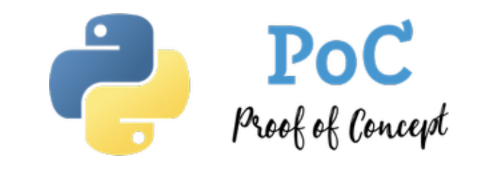

<div align="center">
  

<a href="https://richionline-portfolio.nw.r.appspot.com"></a>

    
  
[](https://richionline-portfolio.nw.r.appspot.com) [](https://twitter.com/richionline)

[](https://www.python.org) 
</div>

---
### python_PoC

Different PoC Python projects. Every folder is a project with a different PoC.

##### Setup for all PoC's
```bash
pip install -r requirements.txt
```

##### Running the app
Every project has its own execution script.

##### Environment vars

---

### PoC index
#### 1. fastapi_python_web_apis
Small program to test fastapi package.

- App --> http://127.0.0.1:8000/
- API Documentation --> http://127.0.0.1:8000/docs
- Alternative API Documentation (provided by Redoc) --> http://127.0.0.1:8000/redoc

#### 2. asyncio
Tests and PoC with asyncio library.